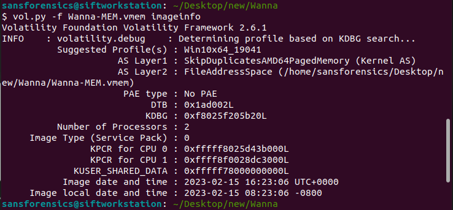

# 0xL4ugh CTF 2023

&#x20;Fri, 17 Feb. 2023, 20:00 SGT — Sat, 18 Feb. 2023, 20:00 SGT

### Forensics

<figure><figcaption>
ATT IP challenge description
</figcaption></figure>

Checking Statistics > Protocol Hierarchy and applying the Data as filter brings me to the conversation between 2 IP addresses.

<figure><figcaption>
Protocol Hierarchy
</figcaption></figure>

<figure><figcaption>
Following Data
</figcaption></figure>

192.168.x.x is a private IP address so the C2 IP can only be 91.243.59.76 with the port 23927.

Hence the flag is 0xL4ugh{91.243.59.76\_23927}.

<figure><figcaption>
Wanna 1 challenge description
</figcaption></figure>

This challenge was quite similar to one of my malware analysis module assignment.

They provided a VMEM file which I used volatility to find the profile.

<figure><figcaption>
imageinfo command
</figcaption></figure>

Then I used the command in the screenshot to obtain the SHA256.

<figure><figcaption>
SHA256 command
</figcaption></figure>

Hence the flag is 0xL4ugh{7f7c94e941d39f7b6217e98295c761c90d215eea0fe988327984d8f57bf86205\_Win10x64\_19041}

### OSINT&#x20;

<figure><figcaption>
Cat challenge description
</figcaption></figure>

The file given is a cat photograph with the watermark of the photographer.

.png>)

At first, I tried checking the EXIF data of the image but it was already erased.

Then I googled the author + 'cat' to find his flickr account where he keeps a collection of his photos.

Scrolling through his profile allowed me to find the original picture.

<figure><figcaption>
flickr account of author
</figcaption></figure>

Then the information can be found when I clicked into the picture.

<figure><figcaption>
Photo detail
</figcaption></figure>

Then upon clicking the map, the location can be found on the address bar.

<figure><figcaption>
Answer
</figcaption></figure>

Hence the flag is 0xL4ugh{29.386886,47.977166}

### Steganography

<figure><figcaption>
Uraa challenge description
</figcaption></figure>

For this challenge I had to install steghide and stegseek in Linux.

Stegseek can also be used to extract steghide metadata without a password, which can be used to test whether a file contains steghide data by using the wordlist built into Kali Linux.

<figure><figcaption>
stegseek
</figcaption></figure>

Having the passphrase allows me to extract the hidden data.

.png>).png>)

And there we have the flag 0xL4ugh{W4RM\_UP\_STE94N0\_G0OD\_J0B}.

This CTF was overall quite fun for me, presenting me a chance to apply what I have learnt in class as well as learning some new skills, unfortunately was quite busy with school to do more.
